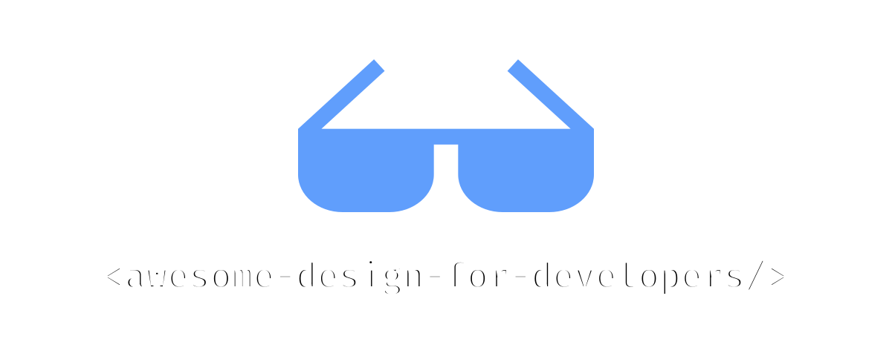

# Großartige Design-Assets für Entwickler 

Auch verfügbar in: [English](README.md) | [中文](README.zh.md) | [Español](README.es.md) | [Français](README.fr.md) | [日本語](README.ja.md)

## Inhalt

- [UI-Bibliotheken](#ui-bibliotheken)
- [Icons](#icons)
- [Illustrationen](#illustrationen)
- [Vorlagen](#vorlagen)
- [Fotografie](#fotografie)
- [Schriftarten](#schriftarten)
- [Farben](#farben)
- [Werkzeuge](#werkzeuge)
- [Bücher](#bücher)
- [Communities](#communities)

## UI-Bibliotheken

- [Shadcn](https://ui.shadcn.com) - Ein Set wunderschön gestalteter, barrierefreier Komponenten und eine Code-Verteilungsplattform. Funktioniert mit Ihren Lieblings-Frameworks.
- [Radix UI](https://www.radix-ui.com/) - Eine Open-Source-Komponentenbibliothek, optimiert für schnelle Entwicklung, einfache Wartung und Barrierefreiheit.
- [Magic UI](https://magicui.design) - Über 150 kostenlose und Open-Source-animierte Komponenten und Effekte, erstellt mit React, TypeScript, Tailwind CSS und Motion.
- [Aceternity UI](https://ui.aceternity.com) - Kopieren Sie die trendigsten Komponenten und verwenden Sie sie in Ihren Websites, ohne sich über Styling und Animationen Gedanken machen zu müssen.
- [Cult UI](https://www.cult-ui.com) - Gebrauchsfertige Komponenten für Ihre React-Apps. Shadcn-kompatibel. Mit Tailwindcss gestylt. Kopieren und einfügen, Open Source, typisiert.
- [Animata](https://animata.design) - Handgefertigte Interaktionsanimationen und Effekte aus dem Internet zum Kopieren und Einfügen in Ihr Projekt.
- [Headless UI](https://headlessui.com) - Vollständig ungestylte, vollständig barrierefreie UI-Komponenten, entworfen für schöne Integration mit Tailwind CSS.
- [Uiverse](https://uiverse.io) - Community-erstellte Bibliothek von UI-Elementen. Kopieren als HTML/CSS, Tailwind, React und Figma.
- [Neobrutalism](https://www.neobrutalism.dev) - Eine Sammlung von Neobrutalism-gestylten Komponenten basierend auf shadcn/ui.
- [Origin UI](https://originui.com) - Schöne UI-Komponenten erstellt mit Tailwind CSS und React.
- [blocks.so](https://blocks.so) - Ein Set sauberer, moderner Bausteine zum Kopieren und Einfügen in Ihre Apps. Funktioniert mit allen React-Frameworks.
- [daisyUI](https://daisyui.com) - daisyUI ist das Tailwind CSS-Plugin, das Sie lieben werden! Es bietet nützliche Komponenten-Klassennamen, die Ihnen helfen, weniger Code zu schreiben und schneller zu entwickeln.
- [Preline](https://preline.co) - Eine Open-Source Tailwind CSS-Komponentenbibliothek für alle Bedürfnisse. Kommt mit UI-Beispielen & Blöcken, Vorlagen, Plugins, Figma-Designsystem und mehr.
- [Mantine](https://mantine.dev) - Eine vollständige React-Komponentenbibliothek mit TypeScript-Unterstützung, Themensystem und mächtigen Hooks.
- [Ant Design](https://ant.design) - Eine Unternehmens-UI-Designsprache und React UI-Bibliothek mit dutzenden hochwertigen Komponenten.
- [Chakra UI](https://chakra-ui.com) - Eine einfache, modulare und barrierefreie Komponentenbibliothek für React-Anwendungen.
- [HeroUI](https://www.heroui.com) - Schöne, schnelle und moderne React UI-Bibliothek mit TypeScript-Unterstützung und integriertem Dark Mode.

## Icons

- [Lucide](https://lucide.dev/) - Schöne & konsistente Icons, von der Community erstellt.
- [Phosphor Icons](https://phosphoricons.com) - Eine flexible Icon-Familie für Benutzeroberflächen, Diagramme, Präsentationen — wirklich alles.
- [Tabler Icons](https://tabler.io/icons) - Kostenlose und Open-Source-Icons, entworfen um Ihre Website oder App attraktiv, visuell konsistent und einfach schön zu machen.
- [Heroicons](https://heroicons.com) - Schöne handgefertigte SVG-Icons von den Machern von Tailwind CSS.
- [Remix Icon](https://remixicon.com) - Open-Source neutrale System-Symbole, sorgfältig für Designer und Entwickler entworfen. Alle Icons sind kostenlos für persönliche und kommerzielle Nutzung.
- [Simple Icons](https://simpleicons.org) - Über 3k SVG-Icons für beliebte Marken.
- [React Icons](https://react-icons.github.io/react-icons/) - Fügen Sie beliebte Icons einfach in Ihre React-Projekte mit react-icons ein.
- [Icônes](https://icones.js.org) - Icon-Explorer mit sofortiger Suche.
- [The Thiings Collection](https://www.thiings.co) - Eine wachsende Sammlung von über 5000 kostenlosen 3D-Icons, generiert mit KI. Perfekt für Designer und kreative Projekte.
- [Isocons](https://www.isocons.app) - Isometrische Icons für Ihre Produkte, Projekte, Poster und Präsentationen.
- [pqoqubbw/icons](https://icons.pqoqubbw.dev) - Schön gestaltete animierte Icons.
- [macOS Icon Gallery](https://www.macosicongallery.com) - Eine Sammlung von macOS-Icons.
- [Nucleoapp](https://nucleoapp.com) - 💵 Über 44k Premium-Qualität SVG-Icons, regelmäßig für UIs, Präsentationen und Druckprojekte aktualisiert.

## Illustrationen

- [Artvee](https://artvee.com) - Durchsuchen und laden Sie hochauflösende Public Domain-Gemälde, Poster und Illustrationen herunter.
- [Notioly](https://notioly.com) - Notioly ist eine Sammlung von über 200 Notion-Style-Illustrationen, vollständig anpassbar in SVG und monatlich mit neuen Designs aktualisiert.
- [vectorCraftr](https://vectorcraftr.com) - Alle Illustrationen sind kostenlos für kommerzielle Nutzung.
- [unDraw](https://undraw.co) - Open-Source-Illustrationen für jede Idee, die Sie sich vorstellen und erstellen können.
- [Unsplash Illustrations](https://unsplash.com/illustrations) - Die Internet-Quelle für Visuals. Angetrieben von Creators überall.
- [DrawKit](https://www.drawkit.com) - 💵 Handgezeichnete 2D & 3D Illustrationen, Icons und Animationen. Perfekt für Ihr nächstes Projekt. Alles an einem Ort.
- [Storyset](https://storyset.com) - Großartige kostenlose anpassbare Illustrationen für Ihr nächstes Projekt.
- [Shapefest](https://shapefest.com) - 💵 Über 100K transparente PNG-Bilder schöner 3D-Objekte.
- [Blush](https://blush.design) - Kostenlose anpassbare Illustrationen mit Figma-Plugin. Erstellen, bearbeiten und verwenden Sie Illustrationen in Ihren Designs.
- [Open Peeps](https://www.openpeeps.com) - Eine handgezeichnete Illustrationsbibliothek zum Erstellen von Szenen mit Menschen. Sie können sie in Produktillustration, Marketing, Comics und mehr verwenden.

## Vorlagen

- [Tailwind Plus](https://tailwindcss.com/plus) - 💵 Schön gestaltete, fachmännisch gefertigte Komponenten und Vorlagen, erstellt von den Machern von Tailwind CSS.
- [Aceternity Template](https://pro.aceternity.com/templates) - 💵 Moderne und minimalistische Vorlagen für Ihr nächstes Produkt. Erstellt mit React, NextJS, TailwindCSS, Framer Motion und TypeScript.
- [Shuffle](https://shuffle.dev/) - 💵 Erstellen Sie einfach Landingpages, Dashboards und E-Commerce-Vorlagen.
- [Preline](https://preline.co) - 💵 Eine Open-Source Tailwind CSS-Komponentenbibliothek für alle Bedürfnisse. Kommt mit UI-Beispielen & Blöcken, Vorlagen, Plugins, Figma-Designsystem und mehr.

## Fotografie

- [Unsplash](https://unsplash.com) - Die Internet-Quelle für Visuals. Angetrieben von Creators überall.
- [Pexels](https://www.pexels.com) - Die besten kostenlosen Stock-Fotos, lizenzfreien Bilder & Videos geteilt von Creators.
- [Pixabay](https://pixabay.com) - Atemberaubende lizenzfreie Bilder & lizenzfreier Stock.
- [Burst by Shopify](https://burst.shopify.com) - Kostenlose Stock-Fotos für Websites und kommerzielle Nutzung. Laden Sie hochauflösende Bilder für Ihr nächstes Projekt herunter.
- [StockVault](https://www.stockvault.net) - Kostenlose Stock-Fotos, Grafiken und Videos. Hochwertige Bilder für Ihre kreativen Projekte.
- [Life of pix](https://www.lifeofpix.com) - Kostenlose hochauflösende Fotografie.
- [BARNIMAGES](https://barnimages.com) - Kostenlose hochauflösende Bilder für alle.
- [Little Visuals](https://littlevisuals.co) - Kostenlose, hochauflösende Bilder. Verwenden Sie sie, wie Sie wollen - kostenlos für kommerzielle Nutzung.
- [UI Faces](https://uifaces.co) - Kostenlose KI-generierte Avatare für Ihre kreativen Projekte.
- [Deposit Photos](https://depositphotos.com) - 💵 Lizenzfreie Stock-Fotos, Vektorbilder, Videos und Musik.
- [Freepik](https://www.freepik.com) - 💵 Millionen kostenloser Vektoren, PSD-Dateien, Fotos und KI-generierter Bilder. Premium-Ressourcen für Ihre kreativen Projekte.

## Schriftarten

- [Google Fonts](https://fonts.google.com) - Eine Bibliothek von über 1000 kostenlosen lizenzierten Schriftfamilien und APIs für bequeme Nutzung über CSS und Android.
- [Inter](https://rsms.me/inter/) - Eine variable Schriftfamilie für Text-Benutzeroberflächen.
- [Labor and Wait](https://www.laborandwait.xyz) - 💵 Kaufen Sie kuratierte Qualitätsprodukte und Waren.
- [I Love Typography](https://fonts.ilovetypography.com) - 💵 Kaufen Sie kuratierte Qualitätsschriften von unabhängigen Schriftgießereien.
- [T26](https://www.t26.com) - 💵 Kaufen Sie gut gestaltete Schriften.
- [Klim](https://klim.co.nz) - 💵 Kaufen Sie kuratierte Qualitätsschriften von unabhängigen Schriftgießereien.

## Farben

- [Coolors.co](https://coolors.co) - Der super schnelle Farbpaletten-Generator! Generieren, speichern und teilen Sie perfekte Paletten in Sekunden.
- [Adobe Color](https://color.adobe.com) - Erstellen Sie Farbthemen und -paletten oder durchsuchen Sie tausende Farbkombinationen aus der Color-Community.
- [Tailwind Colors](https://tailwindcss.com/docs/customizing-colors) - Ein umfassendes Farbsystem mit sorgfältig gestalteten Paletten vom Tailwind CSS-Team.
- [HyperColor](https://hypercolor.dev) - Eine kuratierte Sammlung schöner Tailwind CSS-Verläufe mit der vollen Palette der Tailwind CSS-Farben.
- [Color Hunt](https://colorhunt.co) - Farbpaletten für Designer und Künstler.
- [Color Lisa](https://colorlisa.com) - Farbpaletten-Meisterwerke von den größten Künstlern der Welt.
- [Brand Colors](https://brandcolors.net) - Die größte Sammlung offizieller Markenfarb-Codes.
- [The day's color](https://www.thedayscolor.com) - Der tägliche Farb-Digest.
- [Color Drop](https://colordrop.io) - Farbpaletten-Tool für Kreative, um Inspiration für Designs oder Projekte zu erhalten, an denen sie arbeiten.

## Werkzeuge

- [Penpot](https://penpot.app) - Penpot ist das webbasierte Open-Source-Design-Tool, das Designer und Entwickler verbindet.
- [Shots](https://shots.so) - Erstellen Sie erstaunliche Mockups in Sekunden.
- [Rive](https://rive.app) - Ein neuer Weg, Benutzeroberflächen zu entwerfen, zu erstellen und zu versenden.
- [Lottielab](https://www.lottielab.com) - Das Motion-Design-Tool für Produktteams.
- [Notion Avatar Maker](https://notion-avatar.app) - Erstellen von Notion-Style-Avataren.
- [Rotato](https://rotato.app) - 💵 3D-Mockup-Bilder und Filme in Minuten.
- [Spline](https://spline.design) - 💵 Ein Ort zum Entwerfen und Zusammenarbeiten in 3D.
- [Shuffle](https://shuffle.dev/) - 💵 Erstellen Sie einfach Landingpages, Dashboards und E-Commerce-Vorlagen.
- [Framer](https://www.framer.com) - 💵 Der von Designern geliebte Website-Builder.
- [Figma](https://www.figma.com) - 💵 Ein kollaboratives Interface-Design-Tool.
- [Sketch](https://www.sketch.com) - 💵 Ein Toolkit von Designern für Designer, das den Fokus auf Sie und Ihre Arbeit legt.
- [Canva](https://www.canva.com) - 💵 Erstellen Sie mühelos atemberaubende Designs mit Canvas Drag & Drop-Funktion und professionellen Layouts.
- [InVision](https://www.invisionapp.com) - 💵 Digitale Produktdesign-Plattform für die weltbesten Benutzererfahrungen.

## Bücher

- [The Book of Shaders](https://thebookofshaders.com) - Dies ist eine sanfte Schritt-für-Schritt-Anleitung durch das abstrakte und komplexe Universum der Fragment-Shader.
- [Refactoring UI](https://www.refactoringui.com) - 💵 Lassen Sie Ihre Ideen großartig aussehen, ohne auf einen Designer angewiesen zu sein.

## Communities

- [21st.dev](https://21st.dev) - Eine Community von Design-Ingenieuren, um ihre Arbeit zu teilen.
- [Uiverse](https://uiverse.io) - Community-erstellte Bibliothek von UI-Elementen. Kopieren als HTML/CSS, Tailwind, React und Figma.
- [Sketchfab](https://sketchfab.com) - Sketchfab ist eine 3D-Asset-Website zum Veröffentlichen, Teilen, Entdecken, Kaufen und Verkaufen von 3D-, VR- und AR-Inhalten.
- [Pinterest](https://pinterest.com) - Eine visuelle Such- und Entdeckungsplattform, wo Menschen Inspiration finden, Ideen kuratieren und Produkte kaufen—alles an einem positiven Ort online.