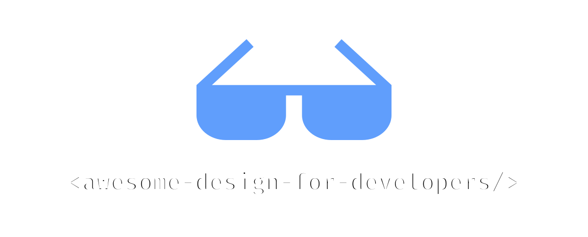

# Ressources de Design Formidables pour Développeurs 

Aussi disponible en : [English](README.md) | [中文](README.zh.md) | [Español](README.es.md) | [Deutsch](README.de.md) | [日本語](README.ja.md)

## Table des matières

- [Bibliothèques UI](#bibliothèques-ui)
- [Icônes](#icônes)
- [Illustrations](#illustrations)
- [Modèles](#modèles)
- [Photographie](#photographie)
- [Polices](#polices)
- [Couleurs](#couleurs)
- [Outils](#outils)
- [Livres](#livres)
- [Communautés](#communautés)

## Bibliothèques UI

- [Shadcn](https://ui.shadcn.com) - Un ensemble de composants magnifiquement conçus et accessibles et une plateforme de distribution de code. Fonctionne avec vos frameworks préférés.
- [Radix UI](https://www.radix-ui.com/) - Une bibliothèque de composants open source optimisée pour un développement rapide, une maintenance facile et l'accessibilité.
- [Magic UI](https://magicui.design) - Plus de 150 composants et effets animés gratuits et open source construits avec React, Typescript, Tailwind CSS et Motion.
- [Aceternity UI](https://ui.aceternity.com) - Copiez-collez les composants les plus tendance et utilisez-les dans vos sites web sans vous soucier du style et des animations.
- [Cult UI](https://www.cult-ui.com) - Composants prêts à l'emploi pour vos applications React. Compatible Shadcn. Stylé avec tailwindcss. Copier-coller, open source, typé.
- [Animata](https://animata.design) - Animations et effets d'interaction faits à la main de partout sur internet à copier et coller dans votre projet.
- [Headless UI](https://headlessui.com) - Composants UI complètement non stylés, entièrement accessibles, conçus pour s'intégrer magnifiquement avec Tailwind CSS.
- [Uiverse](https://uiverse.io) - Bibliothèque d'éléments UI construite par la communauté. Copiez en HTML/CSS, Tailwind, React et Figma.
- [Neobrutalism](https://www.neobrutalism.dev) - Une collection de composants de style néobrutalism basés sur shadcn/ui.
- [Origin UI](https://originui.com) - Beaux composants UI construits avec Tailwind CSS et React.
- [blocks.so](https://blocks.so) - Un ensemble de blocs de construction propres et modernes à copier et coller dans vos applications. Fonctionne avec tous les frameworks React.
- [daisyUI](https://daisyui.com) - daisyUI est le plugin Tailwind CSS que vous adorerez ! Il fournit des noms de classes de composants utiles pour vous aider à écrire moins de code et construire plus rapidement.
- [Preline](https://preline.co) - Une bibliothèque de composants Tailwind CSS open source pour tous les besoins. Livré avec des exemples et blocs UI, modèles, plugins, système de design Figma et plus.
- [Mantine](https://mantine.dev) - Une bibliothèque complète de composants React avec support TypeScript, système de thèmes et hooks puissants.
- [Ant Design](https://ant.design) - Un langage de design UI de classe entreprise et une bibliothèque UI React avec des dizaines de composants de haute qualité.
- [Chakra UI](https://chakra-ui.com) - Une bibliothèque de composants simple, modulaire et accessible pour les applications React.
- [HeroUI](https://www.heroui.com) - Bibliothèque UI React belle, rapide et moderne avec support TypeScript et mode sombre intégré.

## Icônes

- [Lucide](https://lucide.dev/) - Icônes belles et cohérentes créées par la communauté.
- [Phosphor Icons](https://phosphoricons.com) - Une famille d'icônes flexible pour interfaces, diagrammes, présentations — vraiment tout.
- [Tabler Icons](https://tabler.io/icons) - Icônes gratuites et open source conçues pour rendre votre site web ou application attrayante, visuellement cohérente et simplement belle.
- [Heroicons](https://heroicons.com) - Belles icônes SVG faites à la main, par les créateurs de Tailwind CSS.
- [Remix Icon](https://remixicon.com) - Symboles système de style neutre open source élaborés minutieusement pour les designers et développeurs. Toutes les icônes sont gratuites pour usage personnel et commercial.
- [Simple Icons](https://simpleicons.org) - Plus de 3k icônes SVG pour marques populaires.
- [React Icons](https://react-icons.github.io/react-icons/) - Incluez facilement des icônes populaires dans vos projets React avec react-icons.
- [Icônes](https://icones.js.org) - Explorateur d'icônes avec recherche instantanée.
- [The Thiings Collection](https://www.thiings.co) - Une collection croissante de plus de 5000 icônes 3D gratuites, générées par IA. Parfaites pour designers et projets créatifs.
- [Isocons](https://www.isocons.app) - Icônes isométriques pour vos produits, projets, affiches et présentations.
- [pqoqubbw/icons](https://icons.pqoqubbw.dev) - Icônes animées magnifiquement conçues.
- [macOS Icon Gallery](https://www.macosicongallery.com) - Une collection d'icônes macOS.
- [Nucleoapp](https://nucleoapp.com) - 💵 Plus de 44k icônes SVG de qualité premium, régulièrement mises à jour pour UI, présentations et projets d'impression.

## Illustrations

- [Artvee](https://artvee.com) - Parcourez et téléchargez des peintures, affiches et illustrations de domaine public en haute résolution.
- [Notioly](https://notioly.com) - Notioly est une collection de plus de 200 illustrations de style Notion, entièrement personnalisables en SVG et mises à jour mensuellement avec de nouveaux designs.
- [vectorCraftr](https://vectorcraftr.com) - Toutes les illustrations sont gratuites pour usage commercial.
- [unDraw](https://undraw.co) - Illustrations open source pour toute idée que vous pouvez imaginer et créer.
- [Unsplash Illustrations](https://unsplash.com/illustrations) - La source internet pour les visuels. Alimentée par des créateurs de partout.
- [DrawKit](https://www.drawkit.com) - 💵 Illustrations, icônes et animations 2D et 3D dessinées à la main. Parfaites pour votre prochain projet. Tout en un lieu.
- [Storyset](https://storyset.com) - Formidables illustrations personnalisables gratuites pour votre prochain projet.
- [Shapefest](https://shapefest.com) - 💵 Plus de 100K images PNG transparentes de beaux objets 3D.
- [Blush](https://blush.design) - Illustrations personnalisables gratuites avec Plugin Figma. Créez, éditez et utilisez des illustrations dans vos designs.
- [Open Peeps](https://www.openpeeps.com) - Une bibliothèque d'illustrations dessinées à la main pour créer des scènes de personnes. Vous pouvez les utiliser dans l'illustration de produit, marketing, bandes dessinées et plus.

## Modèles

- [Tailwind Plus](https://tailwindcss.com/plus) - 💵 Composants et modèles magnifiquement conçus et expertement créés, construits par les créateurs de Tailwind CSS.
- [Aceternity Template](https://pro.aceternity.com/templates) - 💵 Modèles modernes et minimalistes pour construire votre prochain produit. Construits avec React, NextJS, TailwindCSS, Framer Motion et Typescript.
- [Shuffle](https://shuffle.dev/) - 💵 Créez facilement des pages d'atterrissage, tableaux de bord et modèles e-commerce.
- [Preline](https://preline.co) - 💵 Une bibliothèque de composants Tailwind CSS open source pour tous les besoins. Livré avec des exemples et blocs UI, modèles, plugins, système de design Figma et plus.

## Photographie

- [Unsplash](https://unsplash.com) - La source internet pour les visuels. Alimentée par des créateurs de partout.
- [Pexels](https://www.pexels.com) - Les meilleures photos stock gratuites, images libres de droits et vidéos partagées par des créateurs.
- [Pixabay](https://pixabay.com) - Images époustouflantes libres de droits et stock libre de droits.
- [Burst by Shopify](https://burst.shopify.com) - Photos stock gratuites pour sites web et usage commercial. Téléchargez des images haute résolution pour votre prochain projet.
- [StockVault](https://www.stockvault.net) - Photos stock, graphiques et vidéos gratuits. Images de haute qualité pour vos projets créatifs.
- [Life of pix](https://www.lifeofpix.com) - Photographie gratuite haute résolution.
- [BARNIMAGES](https://barnimages.com) - Images gratuites haute résolution pour tous.
- [Little Visuals](https://littlevisuals.co) - Images gratuites, haute résolution. Utilisez-les comme vous voulez - gratuit pour usage commercial.
- [UI Faces](https://uifaces.co) - Avatars gratuits générés par IA pour vos projets créatifs.
- [Deposit Photos](https://depositphotos.com) - 💵 Photos stock libres de droits, images vectorielles, vidéos et musique.
- [Freepik](https://www.freepik.com) - 💵 Millions de vecteurs gratuits, fichiers PSD, photos et images générées par IA. Ressources premium pour vos projets créatifs.

## Polices

- [Google Fonts](https://fonts.google.com) - Une bibliothèque de plus de 1000 familles de polices sous licence gratuite et APIs pour usage pratique via CSS et Android.
- [Inter](https://rsms.me/inter/) - Une famille de polices variable pour interfaces texte.
- [Labor and Wait](https://www.laborandwait.xyz) - 💵 Achetez des produits et biens de qualité, sélectionnés.
- [I Love Typography](https://fonts.ilovetypography.com) - 💵 Achetez des polices de qualité, sélectionnées de fonderies de polices indépendantes.
- [T26](https://www.t26.com) - 💵 Achetez des polices bien conçues.
- [Klim](https://klim.co.nz) - 💵 Achetez des polices de qualité, sélectionnées de fonderies de polices indépendantes.

## Couleurs

- [Coolors.co](https://coolors.co) - Le générateur de palettes de couleurs super rapide ! Générez, sauvegardez et partagez des palettes parfaites en secondes.
- [Adobe Color](https://color.adobe.com) - Créez des thèmes et palettes de couleurs ou parcourez des milliers de combinaisons de couleurs de la communauté Color.
- [Tailwind Colors](https://tailwindcss.com/docs/customizing-colors) - Un système de couleurs complet avec des palettes soigneusement conçues de l'équipe Tailwind CSS.
- [HyperColor](https://hypercolor.dev) - Une collection sélectionnée de beaux dégradés Tailwind CSS utilisant toute la gamme de couleurs Tailwind CSS.
- [Color Hunt](https://colorhunt.co) - Palettes de couleurs pour designers et artistes.
- [Color Lisa](https://colorlisa.com) - Chefs-d'œuvre de palettes de couleurs des plus grands artistes du monde.
- [Brand Colors](https://brandcolors.net) - La plus grande collection de codes couleurs officiels de marques.
- [The day's color](https://www.thedayscolor.com) - Le digest quotidien des couleurs.
- [Color Drop](https://colordrop.io) - Outil de palette de couleurs conçu pour les créatifs pour aider à obtenir de l'inspiration pour les designs ou projets sur lesquels ils travaillent.

## Outils

- [Penpot](https://penpot.app) - Penpot est l'outil de design open source basé web qui fait le lien entre designers et développeurs.
- [Shots](https://shots.so) - Créez des maquettes fantastiques en secondes.
- [Rive](https://rive.app) - Une nouvelle façon de concevoir, construire et expédier des interfaces utilisateur.
- [Lottielab](https://www.lottielab.com) - L'outil de design de mouvement pour équipes produit.
- [Notion Avatar Maker](https://notion-avatar.app) - Création d'avatars style Notion.
- [Rotato](https://rotato.app) - 💵 Images de maquette 3D et films en minutes.
- [Spline](https://spline.design) - 💵 Un lieu pour concevoir et collaborer en 3D.
- [Shuffle](https://shuffle.dev/) - 💵 Créez facilement des pages d'atterrissage, tableaux de bord et modèles e-commerce.
- [Framer](https://www.framer.com) - 💵 Le constructeur de sites web aimé par les designers.
- [Figma](https://www.figma.com) - 💵 Un outil de design d'interface collaboratif.
- [Sketch](https://www.sketch.com) - 💵 Une boîte à outils faite par des designers, pour des designers, qui met l'accent sur vous et votre travail.
- [Canva](https://www.canva.com) - 💵 Créez facilement des designs époustouflants avec la fonction glisser-déposer de Canva et des mises en page professionnelles.
- [InVision](https://www.invisionapp.com) - 💵 Plateforme de design de produit numérique alimentant les meilleures expériences utilisateur du monde.

## Livres

- [The Book of Shaders](https://thebookofshaders.com) - Ceci est un guide doux étape par étape à travers l'univers abstrait et complexe des Fragment Shaders.
- [Refactoring UI](https://www.refactoringui.com) - 💵 Donnez un aspect génial à vos idées, sans dépendre d'un designer.

## Communautés

- [21st.dev](https://21st.dev) - Une communauté d'ingénieurs design pour partager leur travail.
- [Uiverse](https://uiverse.io) - Bibliothèque d'éléments UI construite par la communauté. Copiez en HTML/CSS, Tailwind, React et Figma.
- [Sketchfab](https://sketchfab.com) - Sketchfab est un site web d'actifs 3D utilisé pour publier, partager, découvrir, acheter et vendre du contenu 3D, VR et AR.
- [Pinterest](https://pinterest.com) - Une plateforme de recherche visuelle et découverte où les gens trouvent l'inspiration, organisent des idées et achètent des produits—tout dans un lieu positif en ligne.