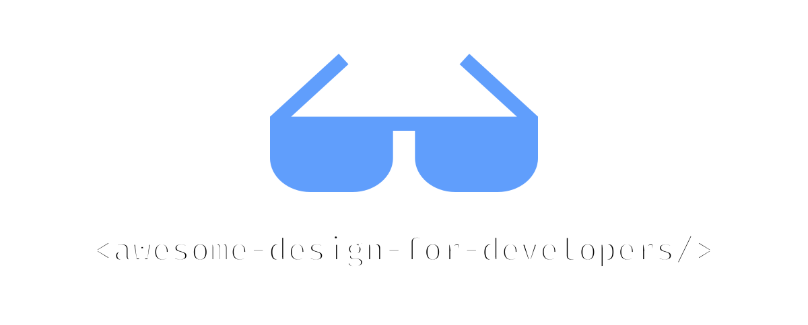

# 開発者向けの素晴らしいデザインアセット 

他の言語でも利用可能：[English](README.md) | [中文](README.zh.md) | [Español](README.es.md) | [Français](README.fr.md) | [Deutsch](README.de.md)

## 目次

- [UI ライブラリ](#uiライブラリ)
- [アイコン](#アイコン)
- [イラスト](#イラスト)
- [テンプレート](#テンプレート)
- [写真](#写真)
- [フォント](#フォント)
- [色](#色)
- [ツール](#ツール)
- [書籍](#書籍)
- [コミュニティ](#コミュニティ)

## UI ライブラリ

- [React Bits](https://reactbits.dev) - 記憶に残るウェブサイトを構築するための、110 以上のアニメーション化されたインタラクティブな完全にカスタマイズ可能な React コンポーネントのオープンソースコレクション。
- [Shadcn](https://ui.shadcn.com) - 美しくデザインされ、アクセシブルなコンポーネントセットとコード配布プラットフォーム。お気に入りのフレームワークで動作します。
- [Radix UI](https://www.radix-ui.com/) - 高速開発、簡単なメンテナンス、アクセシビリティに最適化されたオープンソースコンポーネントライブラリ。
- [Magic UI](https://magicui.design) - React、TypeScript、Tailwind CSS、Motion で構築された 150 以上の無料でオープンソースのアニメーションコンポーネントとエフェクト。
- [Aceternity UI](https://ui.aceternity.com) - 最も人気のあるコンポーネントをコピー＆ペーストして、スタイリングやアニメーションを気にすることなくウェブサイトで使用できます。
- [Cult UI](https://www.cult-ui.com) - React アプリ用のすぐに使えるコンポーネント。Shadcn 互換。tailwindcss でスタイリング。コピー＆ペースト、オープンソース、型付き。
- [Animata](https://animata.design) - インターネットから収集した手作りのインタラクションアニメーションとエフェクトを、プロジェクトにコピー＆ペーストできます。
- [Headless UI](https://headlessui.com) - 完全にスタイルなし、完全にアクセシブルな UI コンポーネント。Tailwind CSS と美しく統合されるよう設計されています。
- [Uiverse](https://uiverse.io) - コミュニティが構築した UI 要素のライブラリ。HTML/CSS、Tailwind、React、Figma としてコピーできます。
- [Neobrutalism](https://www.neobrutalism.dev) - shadcn/ui をベースにしたネオブルータリズムスタイルのコンポーネントコレクション。
- [Origin UI](https://originui.com) - Tailwind CSS と React で構築された美しい UI コンポーネント。
- [blocks.so](https://blocks.so) - アプリにコピー＆ペーストできるクリーンでモダンな構築ブロックのセット。すべての React フレームワークで動作します。
- [daisyUI](https://daisyui.com) - あなたが愛する Tailwind CSS プラグイン！より少ないコードで高速に構築するのに役立つ便利なコンポーネントクラス名を提供します。
- [Preline](https://preline.co) - あらゆるニーズに対応するオープンソース Tailwind CSS コンポーネントライブラリ。UI サンプル＆ブロック、テンプレート、プラグイン、Figma デザインシステムなどが付属。
- [Mantine](https://mantine.dev) - TypeScript サポート、テーマシステム、強力なフックを備えた本格的な React コンポーネントライブラリ。
- [Ant Design](https://ant.design) - エンタープライズクラスの UI デザイン言語と、数十の高品質コンポーネントを持つ React UI ライブラリ。
- [Chakra UI](https://chakra-ui.com) - React アプリケーション用のシンプルで、モジュラーで、アクセシブルなコンポーネントライブラリ。
- [HeroUI](https://www.heroui.com) - TypeScript サポートと内蔵ダークモードを備えた美しく、高速で、モダンな React UI ライブラリ。

## アイコン

- [IconPark](https://iconpark.bytedance.com) - ByteDance による 2000 以上の高品質アイコン。React、Vue、SVG サポートで SVG アイコンを複数のテーマに変換できます。
- [Lucide](https://lucide.dev/) - コミュニティが作った美しく一貫性のあるアイコン。
- [Phosphor Icons](https://phosphoricons.com) - インターフェース、図表、プレゼンテーション用の柔軟なアイコンファミリー。
- [Tabler Icons](https://tabler.io/icons) - ウェブサイトやアプリを魅力的で、視覚的に一貫性があり、シンプルに美しくするための無料でオープンソースのアイコン。
- [Heroicons](https://heroicons.com) - Tailwind CSS の制作者による美しい手作り SVG アイコン。
- [Remix Icon](https://remixicon.com) - デザイナーと開発者のために精巧に作られたオープンソースのニュートラルスタイルシステムシンボル。すべてのアイコンは個人・商用利用無料。
- [Simple Icons](https://simpleicons.org) - 人気ブランド用の 3000 以上の SVG アイコン。
- [React Icons](https://react-icons.github.io/react-icons/) - react-icons で人気のアイコンを React プロジェクトに簡単に含められます。
- [Icônes](https://icones.js.org) - 即座に検索できるアイコンエクスプローラー。
- [The Thiings Collection](https://www.thiings.co) - AI で生成された 5000 以上の無料 3D アイコンの成長するコレクション。デザイナーやクリエイティブプロジェクトに最適。
- [Isocons](https://www.isocons.app) - 製品、プロジェクト、ポスター、プレゼンテーション用のアイソメトリックアイコン。
- [lucide-animated](https://lucide-animated.com) - 美しく作られたアニメーションアイコン。
- [macOS Icon Gallery](https://www.macosicongallery.com) - macOS アイコンのコレクション。
- [Nucleoapp](https://nucleoapp.com) - 💵 UI、プレゼンテーション、印刷プロジェクト用に定期的に更新される 44k+のプレミアム品質 SVG アイコン。

## イラスト

- [Artvee](https://artvee.com) - 高解像度のパブリックドメインの絵画、ポスター、イラストを閲覧・ダウンロード。
- [Notioly](https://notioly.com) - Notioly は SVG で完全にカスタマイズ可能な 200 以上の Notion 風イラストのコレクションで、新しいデザインで月次更新されます。
- [vectorCraftr](https://vectorcraftr.com) - すべてのイラストが商用利用無料。
- [unDraw](https://undraw.co) - 想像し作成できるあらゆるアイデア用のオープンソースイラスト。
- [Unsplash Illustrations](https://unsplash.com/illustrations) - インターネットのビジュアルソース。世界中のクリエイターによって提供されています。
- [DrawKit](https://www.drawkit.com) - 💵 手描きの 2D・3D イラスト、アイコン、アニメーション。次のプロジェクトに最適。すべて 1 箇所に。
- [Storyset](https://storyset.com) - 次のプロジェクト用の素晴らしい無料カスタマイズ可能イラスト。
- [Shapefest](https://shapefest.com) - 💵 美しい 3D オブジェクトの 100K 以上の透明 PNG 画像。
- [Blush](https://blush.design) - Figma プラグイン付きの無料カスタマイズ可能イラスト。デザインでイラストを作成、編集、使用できます。
- [Open Peeps](https://www.openpeeps.com) - 人々のシーンを作成するための手描きイラストライブラリ。製品イラスト、マーケティング、コミックなどで使用できます。

## テンプレート

- [Tailwind Plus](https://tailwindcss.com/plus) - 💵 Tailwind CSS の制作者による美しくデザインされ、専門的に作られたコンポーネントとテンプレート。
- [Aceternity Template](https://pro.aceternity.com/templates) - 💵 次の製品を構築するためのモダンでミニマリストなテンプレート。React、NextJS、TailwindCSS、Framer Motion、TypeScript で構築。
- [Shuffle](https://shuffle.dev/) - 💵 ランディングページ、ダッシュボード、e コマーステンプレートを簡単に作成。
- [Preline](https://preline.co) - 💵 あらゆるニーズに対応するオープンソース Tailwind CSS コンポーネントライブラリ。UI サンプル＆ブロック、テンプレート、プラグイン、Figma デザインシステムなどが付属。

## 写真

- [Unsplash](https://unsplash.com) - インターネットのビジュアルソース。世界中のクリエイターによって提供されています。
- [Pexels](https://www.pexels.com) - クリエイターが共有する最高の無料ストック写真、ロイヤリティフリー画像、動画。
- [Pixabay](https://pixabay.com) - 素晴らしいロイヤリティフリー画像とロイヤリティフリーストック。
- [Burst by Shopify](https://burst.shopify.com) - ウェブサイトと商用利用のための無料ストック写真。次のプロジェクト用の高解像度画像をダウンロード。
- [StockVault](https://www.stockvault.net) - 無料のストック写真、グラフィック、動画。クリエイティブプロジェクト用の高品質画像。
- [Life of pix](https://www.lifeofpix.com) - 無料高解像度写真。
- [BARNIMAGES](https://barnimages.com) - すべての人のための無料高解像度画像。
- [Little Visuals](https://littlevisuals.co) - 無料、高解像度画像。お好みに応じて使用 - 商用利用無料。
- [UI Faces](https://uifaces.co) - クリエイティブプロジェクト用の無料 AI 生成アバター。
- [Deposit Photos](https://depositphotos.com) - 💵 ロイヤリティフリーストック写真、ベクター画像、動画、音楽。
- [Freepik](https://www.freepik.com) - 💵 数百万の無料ベクター、PSD ファイル、写真、AI 生成画像。クリエイティブプロジェクト用のプレミアムリソース。

## フォント

- [Google Fonts](https://fonts.google.com) - 1000 以上の無料ライセンスフォントファミリーのライブラリと、CSS と Android 経由での便利な使用のための API。
- [Inter](https://rsms.me/inter/) - テキストインターフェース用の可変フォントファミリー。
- [Labor and Wait](https://www.laborandwait.xyz) - 💵 厳選された品質の商品と製品をショッピング。
- [I Love Typography](https://fonts.ilovetypography.com) - 💵 独立系フォント制作会社からの厳選品質フォントをショッピング。
- [T26](https://www.t26.com) - 💵 よくデザインされたフォントを購入。
- [Klim](https://klim.co.nz) - 💵 独立系フォント制作会社からの厳選品質フォントをショッピング。

## 色

- [Coolors.co](https://coolors.co) - 超高速カラーパレットジェネレーター！数秒で完璧なパレットを生成、保存、共有。
- [Adobe Color](https://color.adobe.com) - カラーテーマとパレットを作成するか、Color コミュニティから数千の色の組み合わせを閲覧。
- [Tailwind Colors](https://tailwindcss.com/docs/customizing-colors) - Tailwind CSS チームによる慎重に作られたパレットによる包括的なカラーシステム。
- [HyperColor](https://hypercolor.dev) - Tailwind CSS カラーの全範囲を使用した美しい Tailwind CSS グラデーションの厳選コレクション。
- [Color Hunt](https://colorhunt.co) - デザイナーとアーティストのためのカラーパレット。
- [Color Lisa](https://colorlisa.com) - 世界最高のアーティストによるカラーパレットの傑作。
- [Brand Colors](https://brandcolors.net) - 公式ブランドカラーコードの最大のコレクション。
- [The day's color](https://www.thedayscolor.com) - 毎日のカラーダイジェスト。
- [Color Drop](https://colordrop.io) - 作業中のデザインやプロジェクトのインスピレーションを得るためにクリエイター向けに構築されたカラーパレットツール。

## ツール

- [Skill Icons](https://skillicons.dev) - GitHub リポジトリでスキルを発表。プログラミング言語、フレームワーク、ツール用の 1000 以上のアイコン。
- [Penpot](https://penpot.app) - Penpot は、デザイナーと開発者を橋渡しする Web ベースのオープンソースデザインツール。
- [Shots](https://shots.so) - 数秒で素晴らしいモックアップを作成。
- [Rive](https://rive.app) - ユーザーインターフェースをデザイン、構築、配信する新しい方法。
- [Lottielab](https://www.lottielab.com) - プロダクトチーム用のモーションデザインツール。
- [Notion Avatar Maker](https://notion-avatar.app) - Notion 風アバターの作成。
- [Rotato](https://rotato.app) - 💵 数分で 3D モックアップ画像と動画。
- [Spline](https://spline.design) - 💵 3D でデザインし協力する場所。
- [Shuffle](https://shuffle.dev/) - 💵 ランディングページ、ダッシュボード、e コマーステンプレートを簡単に作成。
- [Framer](https://www.framer.com) - 💵 デザイナーに愛されるウェブサイトビルダー。
- [Figma](https://www.figma.com) - 💵 協同インターフェースデザインツール。
- [Sketch](https://www.sketch.com) - 💵 デザイナーによる、デザイナーのためのツールキット。あなたとあなたの仕事にフォーカス。
- [Canva](https://www.canva.com) - 💵 Canva のドラッグ＆ドロップ機能とプロフェッショナルレイアウトで素晴らしいデザインを簡単に作成。
- [InVision](https://www.invisionapp.com) - 💵 世界最高のユーザー体験を推進するデジタル製品デザインプラットフォーム。

## 書籍

- [The Book of Shaders](https://thebookofshaders.com) - これは、抽象的で複雑な Fragment Shaders の宇宙を通る優しいステップバイステップガイドです。
- [Refactoring UI](https://www.refactoringui.com) - 💵 デザイナーに頼らずにアイデアを素晴らしく見せる。

## コミュニティ

- [21st.dev](https://21st.dev) - 作品を共有するデザインエンジニアのコミュニティ。
- [Uiverse](https://uiverse.io) - コミュニティが構築した UI 要素のライブラリ。HTML/CSS、Tailwind、React、Figma としてコピーできます。
- [Sketchfab](https://sketchfab.com) - Sketchfab は 3D、VR、AR コンテンツを公開、共有、発見、売買するために使用される 3D アセットウェブサイト。
- [Pinterest](https://pinterest.com) - 人々がインスピレーションを見つけ、アイデアをキュレートし、製品を購入するビジュアル検索・発見プラットフォーム—すべてオンラインのポジティブな場所で。
