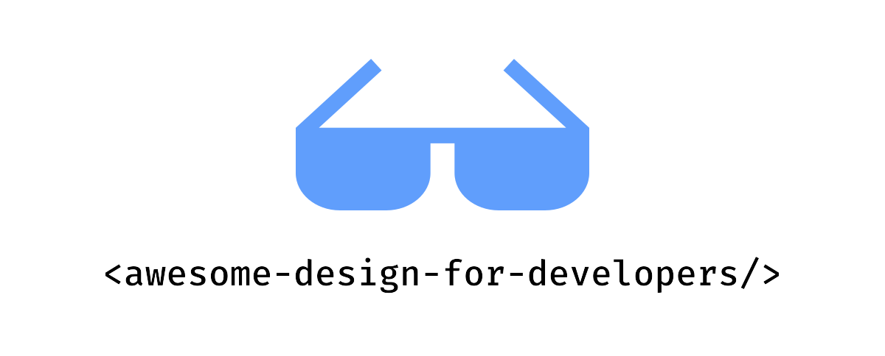

# 開発者向けの素晴らしいデザインアセット 

他の言語でも利用可能：[English](README.md) | [中文](README.zh.md) | [Español](README.es.md) | [Français](README.fr.md) | [Deutsch](README.de.md)

## 目次

- [UI ライブラリ](#uiライブラリ)
- [アイコン](#アイコン)
- [イラスト](#イラスト)
- [テンプレート](#テンプレート)
- [写真](#写真)
- [フォント](#フォント)
- [色](#色)
- [ツール](#ツール)
- [書籍](#書籍)
- [コミュニティ](#コミュニティ)

## UI ライブラリ

- [Shadcn](https://ui.shadcn.com) - 美しくデザインされ、アクセシブルなコンポーネントセットとコード配布プラットフォーム。お気に入りのフレームワークで動作します。
- [Radix UI](https://www.radix-ui.com/) - 高速開発、簡単なメンテナンス、アクセシビリティに最適化されたオープンソースコンポーネントライブラリ。
- [Magic UI](https://magicui.design) - React、TypeScript、Tailwind CSS、Motion で構築された 150 以上の無料でオープンソースのアニメーションコンポーネントとエフェクト。
- [Aceternity UI](https://ui.aceternity.com) - 最も人気のあるコンポーネントをコピー＆ペーストして、スタイリングやアニメーションを気にすることなくウェブサイトで使用できます。
- [Cult UI](https://www.cult-ui.com) - React アプリ用のすぐに使えるコンポーネント。Shadcn 互換。tailwindcss でスタイリング。コピー＆ペースト、オープンソース、型付き。
- [Animata](https://animata.design) - インターネットから収集した手作りのインタラクションアニメーションとエフェクトを、プロジェクトにコピー＆ペーストできます。
- [Headless UI](https://headlessui.com) - 完全にスタイルなし、完全にアクセシブルな UI コンポーネント。Tailwind CSS と美しく統合されるよう設計されています。
- [Uiverse](https://uiverse.io) - コミュニティが構築した UI 要素のライブラリ。HTML/CSS、Tailwind、React、Figma としてコピーできます。
- [Neobrutalism](https://www.neobrutalism.dev) - shadcn/ui をベースにしたネオブルータリズムスタイルのコンポーネントコレクション。
- [Origin UI](https://originui.com) - Tailwind CSS と React で構築された美しい UI コンポーネント。
- [blocks.so](https://blocks.so) - アプリにコピー＆ペーストできるクリーンでモダンな構築ブロックのセット。すべての React フレームワークで動作します。
- [daisyUI](https://daisyui.com) - あなたが愛する Tailwind CSS プラグイン！より少ないコードで高速に構築するのに役立つ便利なコンポーネントクラス名を提供します。
- [Preline](https://preline.co) - あらゆるニーズに対応するオープンソース Tailwind CSS コンポーネントライブラリ。UI サンプル＆ブロック、テンプレート、プラグイン、Figma デザインシステムなどが付属。
- [Mantine](https://mantine.dev) - TypeScript サポート、テーマシステム、強力なフックを備えた本格的な React コンポーネントライブラリ。
- [Ant Design](https://ant.design) - エンタープライズクラスの UI デザイン言語と、数十の高品質コンポーネントを持つ React UI ライブラリ。
- [Chakra UI](https://chakra-ui.com) - React アプリケーション用のシンプルで、モジュラーで、アクセシブルなコンポーネントライブラリ。
- [HeroUI](https://www.heroui.com) - TypeScript サポートと内蔵ダークモードを備えた美しく、高速で、モダンな React UI ライブラリ。
- [Untitled UI](https://www.untitledui.com/react) - Tailwind CSS と React Aria で構築された、世界最大のオープンソース React コンポーネントライブラリ。ピクセルパーフェクトでアクセシブルな UI を実現。
- [React Bits](https://reactbits.dev) - プロジェクトにそのまま組み込めるアニメーション付き React コンポーネント、背景、テキストエフェクト。JS/TS と Tailwind/CSS の各バリアントを提供。
- [Base UI](https://base-ui.com) - Radix、Floating UI、Material UI の開発チームによる、デザインシステム構築向けのアンスタイルでアクセシブルな UI コンポーネント。
- [Park UI](https://park-ui.com) - Ark UI と Panda CSS で構築された美しいコンポーネント。React、Solid、Vue で利用可能。
- [Nuxt UI](https://ui.nuxt.com) - Tailwind CSS でスタイリングされた 125 以上のアクセシブルなコンポーネントを備えた、Vue と Nuxt 向けの総合コンポーネントライブラリ。
- [Ark UI](https://ark-ui.com) - React、Solid、Vue、Svelte 向けの 45 以上のアクセシブルなヘッドレスコンポーネント。独自のデザインシステム構築に最適。
- [Flowbite](https://flowbite.com) - Tailwind CSS で構築され Figma でデザインされた 600 以上の UI コンポーネント・セクション・ページを揃えたオープンソースライブラリ。
- [Once UI](https://once-ui.com) - インディークリエイター向けのオープンソースデザインシステム。100 以上のコンポーネントとテーマを 1 つのファイルで管理できる。

## アイコン

- [Lucide](https://lucide.dev/) - コミュニティが作った美しく一貫性のあるアイコン。
- [Phosphor Icons](https://phosphoricons.com) - インターフェース、図表、プレゼンテーション用の柔軟なアイコンファミリー。
- [Tabler Icons](https://tabler.io/icons) - ウェブサイトやアプリを魅力的で、視覚的に一貫性があり、シンプルに美しくするための無料でオープンソースのアイコン。
- [Heroicons](https://heroicons.com) - Tailwind CSS の制作者による美しい手作り SVG アイコン。
- [Remix Icon](https://remixicon.com) - デザイナーと開発者のために精巧に作られたオープンソースのニュートラルスタイルシステムシンボル。すべてのアイコンは個人・商用利用無料。
- [Simple Icons](https://simpleicons.org) - 人気ブランド用の 3000 以上の SVG アイコン。
- [React Icons](https://react-icons.github.io/react-icons/) - react-icons で人気のアイコンを React プロジェクトに簡単に含められます。
- [Icônes](https://icones.js.org) - 即座に検索できるアイコンエクスプローラー。
- [The Thiings Collection](https://www.thiings.co) - AI で生成された 5000 以上の無料 3D アイコンの成長するコレクション。デザイナーやクリエイティブプロジェクトに最適。
- [Isocons](https://www.isocons.app) - 製品、プロジェクト、ポスター、プレゼンテーション用のアイソメトリックアイコン。
- [lucide-animated](https://lucide-animated.com) - 美しく作られたアニメーションアイコン。
- [macOS Icon Gallery](https://www.macosicongallery.com) - macOS アイコンのコレクション。
- [Hugeicons](https://hugeicons.com) - 複数スタイルで 59,000 以上のアイコン。無料のコアセットと、大規模プロジェクト向けのプロ版ライブラリを用意。
- [SVGL](https://svgl.app) - ブランドの SVG ロゴとワードマークのライブラリ。コピー、ダウンロード、フレームワークへの取り込みに対応。
- [Nucleoapp](https://nucleoapp.com) - 💵 UI、プレゼンテーション、印刷プロジェクト用に定期的に更新される 44k+のプレミアム品質 SVG アイコン。
- [Iconoir](https://iconoir.com) - 1600以上の無料オープンソース SVG アイコン。SVG、Font、React、React Native、Flutter、Figma、Framer に対応。
- [Font Awesome](https://fontawesome.com) - 複数のスタイルで数千のアイコンを提供する定番アイコンライブラリ。Web フォントとしても SVG としても利用できる。
- [OpenMoji](https://openmoji.org) - デザイナーと開発者のためのオープンソース絵文字。カラーと黒線の 2 スタイルを SVG・PNG・フォント形式で提供。
- [Lineicons](https://lineicons.com) - 複数スタイルの無料・有料アイコン 27,000 点以上。Figma ファイルと主要フレームワーク向けパッケージも用意。

## イラスト

- [Artvee](https://artvee.com) - 高解像度のパブリックドメインの絵画、ポスター、イラストを閲覧・ダウンロード。
- [Notioly](https://notioly.com) - Notioly は SVG で完全にカスタマイズ可能な 200 以上の Notion 風イラストのコレクションで、新しいデザインで月次更新されます。
- [vectorCraftr](https://vectorcraftr.com) - すべてのイラストが商用利用無料。
- [unDraw](https://undraw.co) - 想像し作成できるあらゆるアイデア用のオープンソースイラスト。
- [Unsplash Illustrations](https://unsplash.com/illustrations) - インターネットのビジュアルソース。世界中のクリエイターによって提供されています。
- [Absurd Design](https://absurd.design) - 独特なスタイルのシュールな手描きイラストシリーズ。個人利用・商用利用ともに無料。
- [Humaaans](https://www.humaaans.com) - 自由に組み合わせて色を変えられる人物イラスト。CC0 で公開。
- [DrawKit](https://www.drawkit.com) - 💵 手描きの 2D・3D イラスト、アイコン、アニメーション。次のプロジェクトに最適。すべて 1 箇所に。
- [Storyset](https://storyset.com) - 次のプロジェクト用の素晴らしい無料カスタマイズ可能イラスト。
- [Shapefest](https://shapefest.com) - 💵 美しい 3D オブジェクトの 100K 以上の透明 PNG 画像。
- [Blush](https://blush.design) - Figma プラグイン付きの無料カスタマイズ可能イラスト。デザインでイラストを作成、編集、使用できます。
- [Open Peeps](https://www.openpeeps.com) - 人々のシーンを作成するための手描きイラストライブラリ。製品イラスト、マーケティング、コミックなどで使用できます。
- [Open Doodles](https://www.opendoodles.com) - 自由に色替え・拡大縮小・改変ができる、無料でオープンソースの手描きイラスト集。
- [Ouch!](https://icons8.com/illustrations) - Icons8 によるベクター・3D・アニメーションイラスト。ブラウザ上で編集し、SVG や PNG で書き出せる。

## テンプレート

- [Tailwind Plus](https://tailwindcss.com/plus) - 💵 Tailwind CSS の制作者による美しくデザインされ、専門的に作られたコンポーネントとテンプレート。
- [Aceternity Template](https://pro.aceternity.com/templates) - 💵 次の製品を構築するためのモダンでミニマリストなテンプレート。React、NextJS、TailwindCSS、Framer Motion、TypeScript で構築。
- [Shuffle](https://shuffle.dev/) - 💵 ランディングページ、ダッシュボード、e コマーステンプレートを簡単に作成。
- [Preline](https://preline.co) - 💵 あらゆるニーズに対応するオープンソース Tailwind CSS コンポーネントライブラリ。UI サンプル＆ブロック、テンプレート、プラグイン、Figma デザインシステムなどが付属。
- [TailAdmin](https://tailadmin.com) - HTML・React・Next.js・Vue・Angular・Laravel に対応した、オープンソースの Tailwind CSS 管理ダッシュボードテンプレート。
- [Cruip](https://cruip.com) - 💵 HTML・React・Next.js・Vue で実装された、Tailwind CSS のランディングページ／サイト／ダッシュボードテンプレート。

## 写真

- [Unsplash](https://unsplash.com) - インターネットのビジュアルソース。世界中のクリエイターによって提供されています。
- [Pexels](https://www.pexels.com) - クリエイターが共有する最高の無料ストック写真、ロイヤリティフリー画像、動画。
- [Pixabay](https://pixabay.com) - 素晴らしいロイヤリティフリー画像とロイヤリティフリーストック。
- [Burst by Shopify](https://burst.shopify.com) - ウェブサイトと商用利用のための無料ストック写真。次のプロジェクト用の高解像度画像をダウンロード。
- [StockVault](https://www.stockvault.net) - 無料のストック写真、グラフィック、動画。クリエイティブプロジェクト用の高品質画像。
- [Life of pix](https://www.lifeofpix.com) - 無料高解像度写真。
- [BARNIMAGES](https://barnimages.com) - すべての人のための無料高解像度画像。
- [Little Visuals](https://littlevisuals.co) - 無料、高解像度画像。お好みに応じて使用 - 商用利用無料。
- [UI Faces](https://uifaces.co) - クリエイティブプロジェクト用の無料 AI 生成アバター。
- [Nappy](https://nappy.co) - 黒人・褐色の肌の人々を撮影した高解像度の写真。個人利用・商用利用ともに無料。
- [Deposit Photos](https://depositphotos.com) - 💵 ロイヤリティフリーストック写真、ベクター画像、動画、音楽。
- [Freepik](https://www.freepik.com) - 💵 数百万の無料ベクター、PSD ファイル、写真、AI 生成画像。クリエイティブプロジェクト用のプレミアムリソース。
- [Kaboompics](https://kaboompics.com) - 商用利用できる無料ストック写真とキュレーションされた撮影シリーズ。カラーパレットからも検索できる。

## フォント

- [Google Fonts](https://fonts.google.com) - 1000 以上の無料ライセンスフォントファミリーのライブラリと、CSS と Android 経由での便利な使用のための API。
- [Inter](https://rsms.me/inter/) - テキストインターフェース用の可変フォントファミリー。
- [Fontshare](https://www.fontshare.com) - Indian Type Foundry による無料フォントサービス。個人利用・商用利用が可能な高品質書体を提供。
- [Uncut](https://uncut.wtf) - 現代的なオープンソース書体を厳選したライブラリ。無料でダウンロードして利用可能。
- [Labor and Wait](https://www.laborandwait.xyz) - 💵 厳選された品質の商品と製品をショッピング。
- [I Love Typography](https://fonts.ilovetypography.com) - 💵 独立系フォント制作会社からの厳選品質フォントをショッピング。
- [T26](https://www.t26.com) - 💵 よくデザインされたフォントを購入。
- [Klim](https://klim.co.nz) - 💵 独立系フォント制作会社からの厳選品質フォントをショッピング。
- [Pangram Pangram](https://pangrampangram.com) - 💵 高品質な書体を手がける独立系フォントファウンドリ。ライセンス購入前に無料で試用可能。
- [Modern Font Stacks](https://modernfontstacks.com) - 書体分類ごとに整理されたシステムフォントスタックの CSS。ダウンロード不要で即座に表示できる。
- [Fontpair](https://www.fontpair.co) - 厳選された Google Fonts の組み合わせ集。書体・色・アイコンをまとめて試せるプレイグラウンド付き。
- [Future Fonts](https://www.futurefonts.xyz) - 💵 制作途中の書体を割安で購入でき、以後のアップデートをすべて無料で受け取れる。

## 色

- [Coolors.co](https://coolors.co) - 超高速カラーパレットジェネレーター！数秒で完璧なパレットを生成、保存、共有。
- [Adobe Color](https://color.adobe.com) - カラーテーマとパレットを作成するか、Color コミュニティから数千の色の組み合わせを閲覧。
- [Tailwind Colors](https://tailwindcss.com/docs/customizing-colors) - Tailwind CSS チームによる慎重に作られたパレットによる包括的なカラーシステム。
- [HyperColor](https://hypercolor.dev) - Tailwind CSS カラーの全範囲を使用した美しい Tailwind CSS グラデーションの厳選コレクション。
- [Color Hunt](https://colorhunt.co) - デザイナーとアーティストのためのカラーパレット。
- [Color Lisa](https://colorlisa.com) - 世界最高のアーティストによるカラーパレットの傑作。
- [Brand Colors](https://brandcolors.net) - 公式ブランドカラーコードの最大のコレクション。
- [The day's color](https://www.thedayscolor.com) - 毎日のカラーダイジェスト。
- [Color Drop](https://colordrop.io) - 作業中のデザインやプロジェクトのインスピレーションを得るためにクリエイター向けに構築されたカラーパレットツール。
- [Realtime Colors](https://www.realtimecolors.com) - 実際のウェブサイトの UI 上で配色とフォントの組み合わせをリアルタイムにプレビュー。コントラストの即時チェックや CSS/Tailwind エクスポートにも対応。
- [Happy Hues](https://www.happyhues.co) - 実際のページ上で文脈とともに見せてくれる厳選カラーパレット。それぞれの色の使いどころが一目でわかる。
- [Huemint](https://huemint.com) - ブランド、ウェブサイト、グラフィック向けに機械学習でカラーパレットを生成。
- [OKLCH Color Picker](https://oklch.com) - OKLCH 色空間のカラーピッカー兼コンバーター。コントラストチェックと P3 色域プレビューに対応。
- [Radix Colors](https://www.radix-ui.com/colors) - 12 段階のスケールと自動ダークモードを備えた、美しくアクセシブルな UI 向けカラーシステム。
- [UI Colors](https://uicolors.app) - Tailwind CSS 用のカラー生成ツール。実際のコンポーネント上でパレットを確認し、設定を書き出せる。

## ツール

- [Penpot](https://penpot.app) - Penpot は、デザイナーと開発者を橋渡しする Web ベースのオープンソースデザインツール。
- [Shots](https://shots.so) - 数秒で素晴らしいモックアップを作成。
- [Rive](https://rive.app) - ユーザーインターフェースをデザイン、構築、配信する新しい方法。
- [Lottielab](https://www.lottielab.com) - プロダクトチーム用のモーションデザインツール。
- [Notion Avatar Maker](https://notion-avatar.app) - Notion 風アバターの作成。
- [Haikei](https://haikei.app) - ブラウザ上でユニークな SVG の背景、ブロブ、波などのデザインアセットを生成。
- [ray.so](https://ray.so) - コードスニペットを共有しやすい美しい画像に変換。Raycast チームによるツール。
- [tldraw](https://www.tldraw.com) - 図やワイヤーフレーム、アイデアをスケッチできる、共同編集対応の無限ホワイトボード。
- [Rotato](https://rotato.app) - 💵 数分で 3D モックアップ画像と動画。
- [Spline](https://spline.design) - 💵 3D でデザインし協力する場所。
- [Shuffle](https://shuffle.dev/) - 💵 ランディングページ、ダッシュボード、e コマーステンプレートを簡単に作成。
- [Framer](https://www.framer.com) - 💵 デザイナーに愛されるウェブサイトビルダー。
- [Figma](https://www.figma.com) - 💵 協同インターフェースデザインツール。
- [Sketch](https://www.sketch.com) - 💵 デザイナーによる、デザイナーのためのツールキット。あなたとあなたの仕事にフォーカス。
- [Canva](https://www.canva.com) - 💵 Canva のドラッグ＆ドロップ機能とプロフェッショナルレイアウトで素晴らしいデザインを簡単に作成。
- [InVision](https://www.invisionapp.com) - 💵 世界最高のユーザー体験を推進するデジタル製品デザインプラットフォーム。
- [Screen Studio](https://screen.studio) - 💵 自動ズームと滑らかなアニメーションを備えた macOS 向け画面録画ツール。洗練された製品デモに最適。
- [Open Props](https://open-props.style) - 強化された CSS 変数。色・グラデーション・シャドウ・イージングなどを丁寧に設計したデザイントークン集。
- [Hero Patterns](https://heropatterns.com) - 色と不透明度をカスタマイズできる、繰り返し使える SVG 背景パターン集。
- [MagicPattern](https://www.magicpattern.design) - 背景・パターン・グラデーションなどを作れる 30 以上のジェネレーター。画像・SVG・CSS で書き出せる。
- [Checklist Design](https://www.checklist.design) - Web サイト・アプリ・コンポーネント・フローのベストプラクティス集。公開前に細部まで確認できる。
- [The Component Gallery](https://component.gallery) - 数十の公開デザインシステムから集めた実例で構成された、UI コンポーネントのリファレンス。

## 書籍

- [The Book of Shaders](https://thebookofshaders.com) - これは、抽象的で複雑な Fragment Shaders の宇宙を通る優しいステップバイステップガイドです。
- [Laws of UX](https://lawsofux.com) - ユーザーインターフェースを設計する際に参考になる心理学の原則集。
- [Refactoring UI](https://www.refactoringui.com) - 💵 デザイナーに頼らずにアイデアを素晴らしく見せる。
- [Practical Typography](https://practicaltypography.com) - 日常的な文書やインターフェースのためのタイポグラフィを説く Matthew Butterick の書籍。オンラインで無料で読める。
- [Inclusive Components](https://inclusive-components.design) - アクセシブルでインクルーシブな UI コンポーネントを一つずつ設計する方法をまとめたパターンライブラリ。
- [Every Layout](https://every-layout.dev) - 💵 シンプルで組み合わせ可能なレイアウトプリミティブを通じて CSS レイアウトを学び直す一冊。
- [Growth.Design](https://growth.design) - 優れた UX の背後にある心理学を掘り下げる、マンガ形式のプロダクトケーススタディ。

## コミュニティ

- [21st.dev](https://21st.dev) - 作品を共有するデザインエンジニアのコミュニティ。
- [Uiverse](https://uiverse.io) - コミュニティが構築した UI 要素のライブラリ。HTML/CSS、Tailwind、React、Figma としてコピーできます。
- [Sketchfab](https://sketchfab.com) - Sketchfab は 3D、VR、AR コンテンツを公開、共有、発見、売買するために使用される 3D アセットウェブサイト。
- [Pinterest](https://pinterest.com) - 人々がインスピレーションを見つけ、アイデアをキュレートし、製品を購入するビジュアル検索・発見プラットフォーム—すべてオンラインのポジティブな場所で。
- [Awwwards](https://www.awwwards.com) - インターネット上のデザイン・創造性・革新性を表彰するアワード。優れたウェブサイトのディレクトリ付き。
- [Mobbin](https://mobbin.com) - 💵 実際のモバイル・ウェブアプリの画面を検索できるライブラリ。UI・UX のインスピレーションに。
- [Cosmos](https://www.cosmos.so) - デザインのインスピレーションを集め、整理し、共有するためのビジュアル探索スペース。
- [Savee](https://savee.it) - デザイナーがキュレーションしたインスピレーション集。アプリやブラウザ拡張でビジュアル参照を保存できる。
- [Typewolf](https://www.typewolf.com) - タイポグラフィのトレンド情報。実例のフォントの組み合わせやルックブック、学習リソースを紹介。
- [One Page Love](https://onepagelove.com) - 2008 年から手作業で選び続けている、1 ページサイト・セクション・テンプレートのギャラリー。
